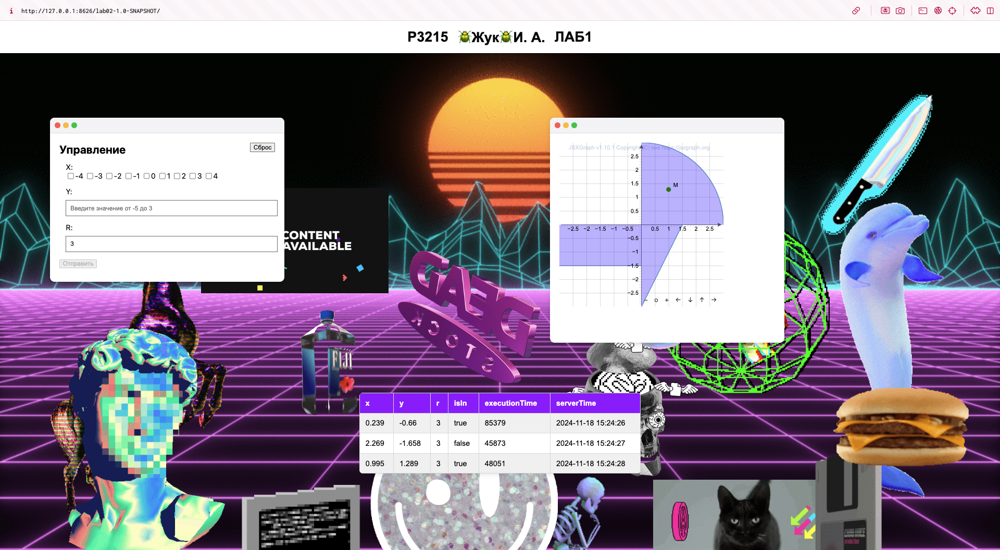

# ITMO-CSE-Web-Lab02

## Описание проекта

Данный проект является второй лабораторной работой по дисциплине "Веб-программирование" в ИТМО на направлении СППО. Проект представляет собой веб-приложение, которое позволяет пользователю вводить координаты и радиус, а затем проверять, попадают ли введенные точки в заданные геометрические фигуры (круг, прямоугольник и треугольник).

## Стек технологий

- Java
- Jakarta EE (Servlets)
- Gson (для работы с JSON)
- HTML/CSS
- JavaScript
- JSXGraph (для визуализации графиков)

## Структура проекта

Проект состоит из следующих основных компонентов:

- **Сервлеты**:
    - `ControllerServlet`: Обрабатывает HTTP-запросы и управляет сессиями.
    - `AreaCheckServlet`: Выполняет проверку попадания точек в фигуры и возвращает результаты.

- **Утилиты**:
    - `AreaChecker`: Логика проверки попадания точек в фигуры.
    - `SingletonGson`: Обеспечивает единственный экземпляр Gson для работы с JSON.
    - `ParseRequest`: Парсит входящие запросы и обрабатывает ошибки.

- **Данные**:
    - `RequestData`: Класс для хранения входных данных (массив X, Y, R).
    - `ResponseData`: Класс для хранения выходных данных (координаты, результат проверки, время выполнения).

- **Визуализация**:
    - HTML-страницы и JavaScript для работы с пользовательским интерфейсом, включая обработку событий и визуализацию графиков с помощью JSXGraph.

## Скриншот с сайта

